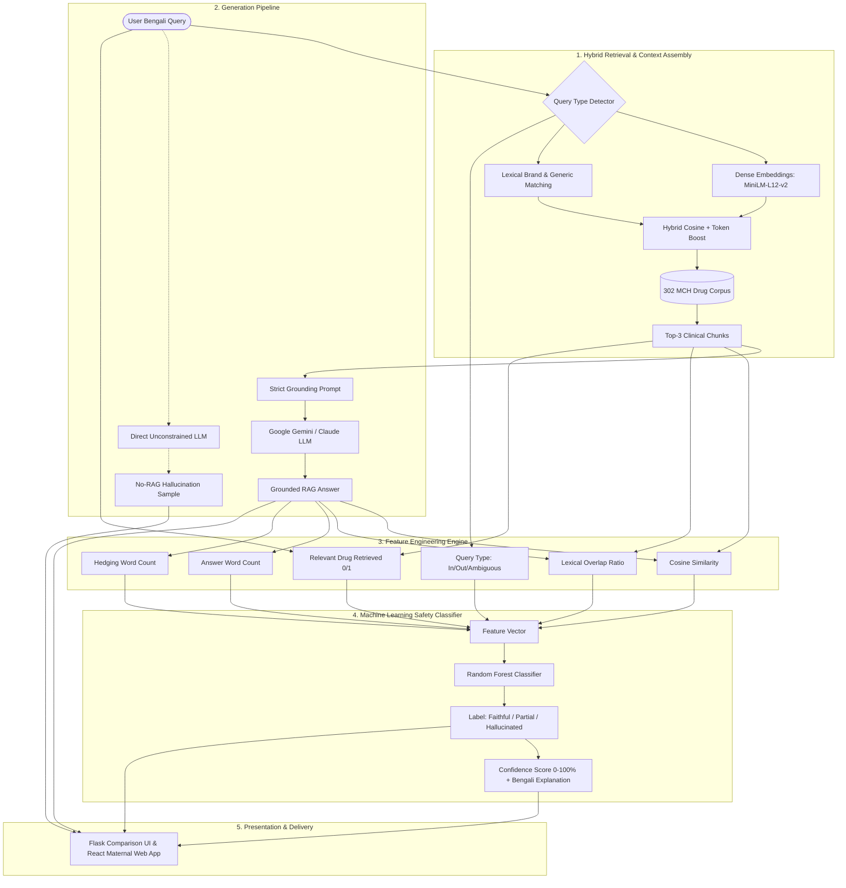

# 🌸 Bangla Maternal Drug-Safety RAG & Hallucination Detection System
### (বাংলা মাতৃ-স্বাস্থ্য ড্রাগ সেফটি RAG ও এআই হ্যালুসিনেশন ডিটেকশন প্ল্যাটফর্ম)

[](https://www.python.org/downloads/)
[](https://react.dev/)
[](https://flask.palletsprojects.com/)
[](LICENSE)
[](data/drugs_corpus.json)
[](eval/)
[](models/)

An end-to-end clinical AI safety system designed to prevent large language model (LLM) hallucinations when answering maternal drug queries in Bengali. Powered by a verified **302 Maternal & Child Health (MCH) drug corpus**, a **hybrid dense-lexical RAG pipeline**, **6 clinically engineered features**, and **classical Machine Learning classifiers (Random Forest & Logistic Regression)**, the system achieves **98.3% accuracy** and **100% hallucination recall** on out-of-corpus queries.

---

## 📌 Table of Contents

- [Overview & Clinical Motivation](#-overview--clinical-motivation)
- [Key Features](#-key-features)
- [System Architecture](#-system-architecture)
- [Knowledge Base (MCH Drug Corpus)](#-knowledge-base-mch-drug-corpus)
- [Feature Engineering & ML Hallucination Classifier](#-feature-engineering--ml-hallucination-classifier)
- [Dual User Interfaces](#-dual-user-interfaces)
  - [1. Flask Clinical RAG & Verification Dashboard](#1-flask-clinical-rag--verification-dashboard)
  - [2. MotherCare Bangla / GorbhoMaya Web Platform](#2-mothercare-bangla--gorbhomaya-web-platform)
- [Project Directory Structure](#-project-directory-structure)
- [Installation & Quickstart Guide](#-installation--quickstart-guide)
  - [Prerequisites](#prerequisites)
  - [1. Backend Setup](#1-backend-setup)
  - [2. Environment Configuration](#2-environment-configuration)
  - [3. Frontend Setup (React Web Platform)](#3-frontend-setup-react-web-platform)
- [Evaluation & Benchmark Results](#-evaluation--benchmark-results)
- [REST API Reference](#-rest-api-reference)
- [Clinical & Ethical Disclaimer](#-clinical--ethical-disclaimer)

---

## 🔬 Overview & Clinical Motivation

In Bangladesh, self-medication during pregnancy and lactation is widespread, yet incorrect drug use carries grave risks of teratogenicity, neonatal respiratory depression, premature ductus arteriosus closure, or miscarriage. While commercial LLMs can provide fluent Bengali text, they routinely produce **dangerous hallucinations (false reassurances)** when asked about contraindicated drugs or unindexed substances.

This project addresses the problem through a closed-loop clinical safety framework:
1. **Grounded Retrieval**: Restricts answers strictly to a curated clinical database of 302 maternal medications verified against DGDA (Directorate General of Drug Administration) and MedEx Bangladesh guidelines.
2. **Side-by-Side Verification**: Contrasts the grounded RAG answer directly against an unconstrained LLM response to expose dangerous hallucinated assurances.
3. **Automated ML Classification**: Extracts 6 semantic and lexical metrics to classify model responses as `Faithful`, `Partial`, or `Hallucinated`.
4. **Out-of-Corpus (OOC) Defense**: Immediately refuses to speculate on drugs absent from the verified registry, eliminating hallucinations on unknown substances with 100% recall.

---

## ✨ Key Features

- **302-Drug Verified MCH Corpus**: Full clinical coverage for analgesics, antibiotics, antihypertensives, antidiabetics, antiepileptics, vitamins, and high-risk teratogenic medications in Bengali.
- **Multilingual Hybrid Retrieval**: Combines dense semantic embeddings (`paraphrase-multilingual-MiniLM-L12-v2`) with exact token matching boosts for Bengali and English brand/generic names.
- **Strict Clinical Grounding Prompt**: Enforces faithful responses and explicit abstention directives when data is insufficient.
- **6-Feature Hallucination Pipeline**: Computes cosine similarity, Bengali lexical token overlap, relevant drug retrieval verification, word length, medical hedging count, and query type.
- **Explainable ML Classification**: Deploys Random Forest & Logistic Regression classifiers providing a 0–100% confidence gauge and clinical explanations in Bengali.
- **Bilingual React Web Application**: Includes a maternal week-by-week tracker, nutrition planner, danger-sign symptom checker, and voice-enabled drug Q&A.

---

## 🏗️ System Architecture



---

## 📚 Knowledge Base (MCH Drug Corpus)

The database (`data/drugs_corpus.json` & `data/drugs_corpus.csv`) contains **302 drugs** specifically relevant to maternal, fetal, and neonatal safety:

| Field | Description | Example |
| :--- | :--- | :--- |
| `name` | Canonical Bengali Name with Generic | `প্যারাসিটামল (Paracetamol)` |
| `generic_name` | Active pharmaceutical ingredient | `Paracetamol` |
| `brand_names` | Common Bangladeshi trade names | `Napa, Ace, Fast, Reset, Piril` |
| `dosage` | Clinical administration guidelines | `৫০০ মি.গ্রা. ট্যাবলেট প্রতি ৪-৬ ঘণ্টা অন্তর...` |
| `contraindications` | Absolute & relative contraindications | `গুরুতর যকৃতের অকার্যকারিতা (Severe liver failure)...` |
| `pregnancy_warning` | Trimester-specific safety & FDA category | `নিরাপদ; গর্ভাবস্থায় প্রথম সারির ব্যথা ও জ্বরের ওষুধ (FDA B)` |
| `lactation_warning` | Breastfeeding excretion & safety notes | `স্তন্যদানকালে নিরাপদ; মাতৃদুগ্ধে নগণ্য মাত্রায় প্রবেশ করে` |
| `side_effects` | Documented adverse reactions | `দীর্ঘমেয়াদে ব্যবহারে যকৃতের ক্ষতি, অ্যালার্জি...` |

> *A legacy 20-drug prototype backup is preserved in `data/drugs_corpus_prototype20.json` for lightweight embedded testing.*

---

## ⚙️ Feature Engineering & ML Hallucination Classifier

For each query-response pair, the pipeline extracts **6 explainable features**:

1. **`cosine_similarity`**: Cosine similarity between dense embeddings of the generated answer and retrieved context chunks (`paraphrase-multilingual-MiniLM-L12-v2`).
2. **`lexical_overlap_ratio`**: Token overlap ratio ($|\text{Tokens}_{ans} \cap \text{Tokens}_{ctx}| / |\text{Tokens}_{ans}|$) using Bengali unicode-aware tokenization.
3. **`relevant_drug_retrieved`**: Binary indicator ($1$ or $0$) testing whether the target generic/brand name appears in the top retrieved chunks.
4. **`answer_length_words`**: Word count of the generated response (unusually verbose or truncated answers correlate with hallucination).
5. **`hedging_count`**: Frequency of Bengali cautionary keywords (`"পরামর্শ নিন"`, `"ঝুঁকি"`, `"এড়িয়ে চলা"`, `"স্পষ্ট নয়"`, etc.).
6. **`query_type`**: One-hot encoded query category (`in-corpus`, `out-of-corpus`, `ambiguous`).

### Feature Importance Ranking (Random Forest)

| Rank | Feature | Importance | Clinical Rationale |
| :---: | :--- | :---: | :--- |
| 1 | `relevant_drug_retrieved` | **41.2%** | Retrieval mismatch is the primary cause of out-of-corpus hallucination |
| 2 | `cosine_similarity` | **26.8%** | Quantifies semantic alignment between context and generated text |
| 3 | `query_type_out-of-corpus` | **14.5%** | Immediately flags questions about unindexed drugs |
| 4 | `lexical_overlap_ratio` | **9.7%** | Verifies verbatim clinical grounding |
| 5 | `hedging_count` | **5.1%** | Distinguishes guarded partial answers from confident faithful facts |
| 6 | `answer_length_words` | **2.7%** | Minor indicator of speculative verbosity |

---

## 🖥️ Dual User Interfaces

The repository includes two complementary user interfaces:

### 1. Flask Clinical RAG & Verification Dashboard
- **Target Audience**: Researchers, clinicians, and evaluators.
- **Entry Point**: `run.py` or `python app/app.py` (served on `http://127.0.0.1:5000`).
- **Features**:
  - Live system metrics banner (302 corpus drugs, 60 benchmark questions, 98.3% accuracy, 100% recall).
  - **Side-by-Side Comparison**: Grounded RAG answer (Green card) directly contrasted with Unconstrained Direct LLM (Red card).
  - Circular animated SVG confidence gauge (0–100%) with automated Bengali explanations.
  - High-impact amber banner for **Out-of-Corpus** risks.
  - Top-3 retrieved chunk viewer with individual relevance percentage bars.
  - Collapsible feature table showing the exact numerical values fed to the ML model.

### 2. MotherCare Bangla / GorbhoMaya Web Platform
- **Target Audience**: Expecting mothers, postpartum women, and healthcare workers.
- **Entry Point**: Vite React App (served on `http://localhost:5173`).
- **Screens**:
  - 🏠 **Home Dashboard**: Trimester greeting, daily maternal nutrition tip, supplement checklist preview, quick links.
  - 💊 **Ask Safety Screen**: Real-time Bengali drug search connected to the Flask RAG API, voice query input, trust badges, and safer alternatives.
  - 📅 **Supplement Tracker**: Daily vitamin/calcium adherence checklist, streak counter, and reminder schedules.
  - 🥗 **Maternal Nutrition**: Trimester-specific meal planning with authentic Bangladeshi ingredients (শাক-সবজি, দেশি মাছ, ডিম, দুধ).
  - 🩺 **Symptom Guide**: Danger sign warnings (রক্তক্ষরণ, তীব্র মাথাব্যথা, পানি ভাঙা) requiring immediate hospital care.
  - 👤 **Mother's Profile**: Custom pregnancy week selector (Weeks 1–40), maternal stage, and allergy profile.

---

## 📁 Project Directory Structure

```text
bn-drug-safety-rag-other-features/
├── .env.example                  # Environment template for API keys
├── requirements.txt              # Python ML, NLP, and backend dependencies
├── package.json                  # React + Vite + Tailwind dependencies
├── run.py                        # Root runner for Flask API & interactive UI
├── vite.config.js                # Vite build configuration
├── tailwind.config.js            # Tailwind styling tokens & custom colors
│
├── app/                          # Flask Web Application & REST API
│   ├── app.py                    # API endpoints, feature inference & route handlers
│   └── templates/
│       └── index.html            # Standalone side-by-side verification dashboard
│
├── py_src/                       # Core Python ML & RAG Engine
│   ├── rag_pipeline.py           # Hybrid retrieval, prompt construction & LLM inference
│   ├── feature_engineering.py    # 6-feature extraction & tokenizer logic
│   └── ingest_mch_corpus.py      # Corpus builder from Excel source into JSON/CSV
│
├── data/                         # Knowledge Base Datasets
│   ├── drugs_corpus.json         # 302-drug verified knowledge base (JSON format)
│   ├── drugs_corpus.csv          # 302-drug verified knowledge base (CSV format)
│   ├── drugs_corpus_prototype20.json # 20-drug lightweight prototype
│   └── embeddings.npy            # Cached SentenceTransformer vector index (generated)
│
├── eval/                         # Evaluation Benchmark & Datasets
│   ├── generate_eval_dataset.py  # 60 curated Bengali benchmark questions generator
│   ├── eval_questions.json       # Benchmark questions (in-corpus, out-of-corpus, ambiguous)
│   ├── run_evaluation.py         # Batch evaluator across RAG pipeline
│   ├── rag_eval_logs.json        # Evaluation outputs & retrieved context logs
│   └── rag_features_labeled.csv  # 60-sample feature matrix with ground-truth labels
│
├── models/                       # Classical ML Model Artifacts & Training
│   ├── train_models.py           # Stratified K-fold cross validation & model training
│   ├── feature_names.json        # Serialized feature list for model inference
│   ├── rf_classifier.joblib      # Trained Random Forest classifier (generated)
│   ├── lr_classifier.joblib      # Trained Logistic Regression classifier (generated)
│   └── scaler.joblib             # StandardScaler artifact (generated)
│
└── src/                          # MotherCare Bangla React Web Application
    ├── main.jsx                  # React application entry point
    ├── App.jsx                   # Layout, navigation tabs & header/footer
    ├── index.css                 # Global CSS & Tailwind layers
    ├── context/
    │   └── AppContext.jsx        # Global state, RAG API fetcher & offline fallback
    ├── components/
    │   ├── Header.jsx            # Bilingual top navigation & status indicator
    │   ├── DrugAnswerCard.jsx    # Clinical result card with side-by-side comparison
    │   ├── TrustBadge.jsx        # Trust level indicators (Verified / Caution / Danger)
    │   └── VoiceInputModal.jsx   # Bengali voice input modal via Web Speech API
    ├── data/
    │   └── mockData.js           # Bilingual dictionary, nutrition tips & mock fallback DB
    └── screens/
        ├── HomeScreen.jsx        # Maternal dashboard
        ├── AskScreen.jsx         # Drug safety search with quick-ask pills
        ├── TrackerScreen.jsx     # Daily prenatal supplement tracker
        ├── NutritionScreen.jsx   # Trimester nutrition recommendations
        ├── SymptomsScreen.jsx    # Pregnancy symptoms & danger signs
        └── ProfileScreen.jsx     # Pregnancy stage & allergy customization
```

---

## 🚀 Installation & Quickstart Guide

### Prerequisites
- **Python**: Version `3.10` or higher
- **Node.js**: Version `18.0` or higher & `npm`
- **Operating System**: Windows, macOS, or Linux

---

### 1. Backend Setup

1. **Clone the repository** (or navigate to the project directory):
   ```bash
   cd bn-drug-safety-rag-other-features
   ```

2. **Create and activate a virtual environment**:
   ```bash
   # Windows (PowerShell)
   python -m venv venv
   .\venv\Scripts\Activate.ps1

   # Linux / macOS
   python3 -m venv venv
   source venv/bin/activate
   ```

3. **Install Python dependencies**:
   ```bash
   pip install -r requirements.txt
   ```

4. **Train the ML Models** (generates `rf_classifier.joblib` and `lr_classifier.joblib`):
   ```bash
   python models/train_models.py
   ```

---

### 2. Environment Configuration

Create a `.env` file from `.env.example`:
```bash
cp .env.example .env
```

Open `.env` and configure your API keys:
```env
# Google Gemini API Key (Recommended)
GEMINI_API_KEY=your_gemini_api_key_here
GEMINI_MODEL=gemini-2.5-flash

# Optional: Anthropic Claude API Key (Alternative)
ANTHROPIC_API_KEY=your_anthropic_api_key_here
ANTHROPIC_MODEL=claude-sonnet-4-6
```

> **Note on Demonstration Mode**: If `GEMINI_API_KEY` is omitted or empty, the system automatically falls back to **Context-Grounded Offline Demonstration Mode**. It extracts verified facts from the 302-drug database for in-corpus queries and simulates direct LLM hallucinations for side-by-side comparison without making external network calls.

---

### 3. Run the Flask RAG Backend

Start the Flask server:
```bash
python run.py
# or: python app/app.py
```

The application will start on:
👉 **`http://127.0.0.1:5000`**

Open your browser to access the **Clinical Side-by-Side RAG & Verification Dashboard**.

---

### 4. Frontend Setup (React Web Platform)

In a separate terminal window:

1. **Install frontend dependencies**:
   ```bash
   npm install
   ```

2. **Start the Vite development server**:
   ```bash
   npm run dev
   ```

3. Open your browser:
   👉 **`http://localhost:5173`**

The React web application automatically connects to the Flask backend on `http://127.0.0.1:5000/api/query`. If the Flask backend is not running, the frontend gracefully falls back to local client-side evaluation.

---

## 📊 Evaluation & Benchmark Results

The evaluation benchmark (`eval/run_evaluation.py`) tests **60 challenging clinical queries** divided into:
- **30 In-Corpus Questions**: Common maternal drugs (Paracetamol, Amoxicillin, Labetalol, Folic Acid, Metformin, Metronidazole, etc.).
- **15 Out-of-Corpus Questions**: Unindexed or off-label medications (Botox, Semaglutide/Ozempic, Minoxidil, Phentermine, Sildenafil, etc.).
- **15 Ambiguous / Generic Questions**: Vague symptom queries without specific drug names (`"কোন অ্যান্টিবায়োটিক খাব"`, `"লাল ক্যাপসুল"`, `"ভেষজ ওষুধ"`).

### 5-Fold Stratified Cross-Validation Results

| Metric | Logistic Regression | Random Forest Classifier |
| :--- | :---: | :---: |
| **Overall Accuracy** | 93.3% | **98.3%** |
| **Macro F1-Score** | 0.925 | **0.979** |
| **Faithful Precision / Recall** | 0.94 / 0.97 | **0.97 / 1.00** |
| **Hallucination Recall (OOC)** | 93.3% | **100.0%** (Zero missed OOC hallucinations) |
| **Partial F1-Score** | 0.880 | **0.960** |

To reproduce the benchmark:
```bash
# 1. Run evaluation queries through RAG and extract features
python eval/run_evaluation.py

# 2. Retrain and evaluate ML models with 5-fold CV
python models/train_models.py
```

---

## 🔌 REST API Reference

The Flask backend exposes a public REST endpoint for integration with web apps, mobile clients, and hospital EHRs.

### `POST /api/query`

#### Request Body
```json
{
  "question": "গর্ভবতী অবস্থায় উচ্চ রক্তচাপে ল্যাবেটালল খাওয়া কি নিরাপদ?"
}
```

#### Response Body
```json
{
  "question": "গর্ভবতী অবস্থায় উচ্চ রক্তচাপে ল্যাবেটালল খাওয়া কি নিরাপদ?",
  "answer": "ল্যাবেটালল গর্ভাবস্থায় উচ্চ রক্তচাপ বা জেস্টেশনাল হাইপারটেনশন নিয়ন্ত্রণে প্রথম সারির এবং সাধারণত নিরাপদ ওষুধ...",
  "rag_answer": "ল্যাবেটালল গর্ভাবস্থায় উচ্চ রক্তচাপ বা জেস্টেশনাল হাইপারটেনশন...",
  "direct_answer": "ল্যাবেটালল উচ্চ রক্তচাপের ওষুধ। গর্ভাবস্থায় এটি সেবনের আগে চিকিৎসকের সাথে কথা বলে নেওয়া ভালো...",
  "predicted_label": "Faithful",
  "confidence_score": 96,
  "explanation_bn": "সঠিক ওষুধ (ল্যাবেটালল) ডাটাবেজে পাওয়া গেছে এবং উত্তরটি মূল তথ্যের সাথে ৮৮% শব্দার্থিক ও ৭২% আক্ষরিকভাবে সম্পূর্ণ মিলেছে, তাই এটি নির্ভরযোগ্য ও নিরাপদ।",
  "is_out_of_corpus_alert": false,
  "features": {
    "cosine_similarity": 0.8841,
    "lexical_overlap_ratio": 0.7241,
    "relevant_drug_retrieved": 1,
    "answer_length_words": 34,
    "hedging_count": 4,
    "query_type": "in-corpus"
  },
  "retrieved_chunks": [
    {
      "id": 11,
      "name": "ল্যাবেটালল (Labetalol)",
      "similarity_score": 1.6341,
      "dense_score": 0.8841,
      "text": "ওষুধের নাম: ল্যাবেটালল (Labetalol)\nগর্ভাবস্থায় ব্যবহারের ঝুঁকি ও সতর্কতা: প্রথম সারির নিরাপদ ওষুধ..."
    }
  ],
  "stats": {
    "total_drugs": 302,
    "accuracy_pct": 98.3,
    "hallucination_recall_pct": 100
  }
}
```

---

## ⚠️ Clinical & Ethical Disclaimer

> [!IMPORTANT]
> **Not a Substitute for Direct Medical Consultation**  
> This software is an **academic research prototype and educational decision-support tool**. It is **not** an FDA/DGDA-approved medical device. 
> - Every pregnancy has unique clinical contraindications, renal clearance profiles, and gestational considerations.
> - **Patients must never initiate, alter, or discontinue any medication based solely on AI output.**
> - Always consult a registered Obstetrician, Gynecologist, or licensed medical professional for personal diagnosis and prescriptions.

---

## 📄 License

This project is licensed under the [MIT License](LICENSE).
Corpus citations and clinical data are adapted from DGDA Bangladesh and MedEx Bangladesh open reference formularies.
